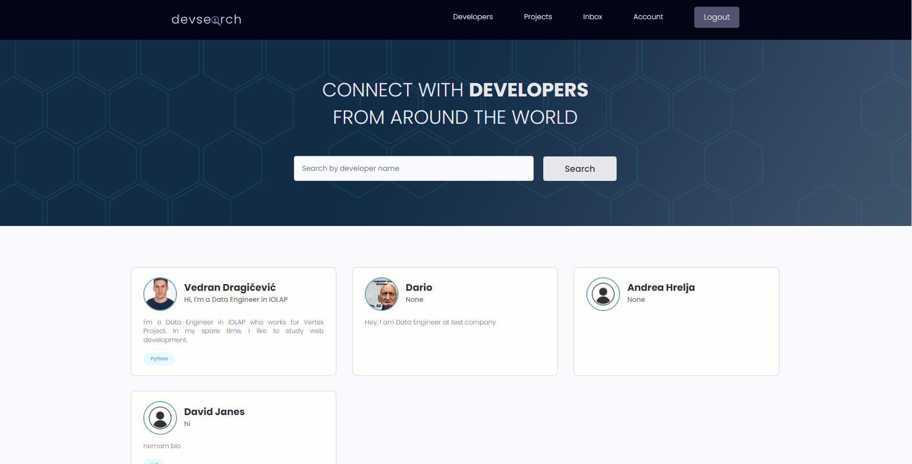
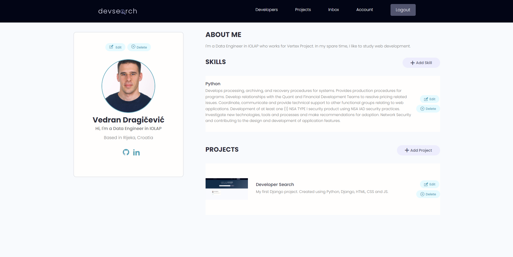

# Python Django Website Project
A Python Django project based on the popular **Udemy** course '*Python And Django Framework For Beginners Complete Course*'.
 
Key elements of the course:
<ul> 
    <li>
    Go from Beginner to Advanced in Python Programming by learning all of the basics to Object Orientated Programming
    </li>
    <li>
    Utilize core programming tools such as functions and loops
    </li>
    <li>
    Django Web Framework Introduction
    </li>
    <li>
    Django Framework With Building Projects
    </li>
    <li>
    Write scripts for general productivity tasks and gain knowledge in regard to general programming concepts
    </li>
</ul>
 Web application has modified **CSS** and more features than the one in the course. Application was built using **Django**, **Python**, **HTML**, **BOOTSTRAP** and **JS**. 

Udemy course URL (https://www.udemy.com/course/python-and-django-for-beginners/).

<h3>Main Page

  

 

<h3>Account Page

  

 

